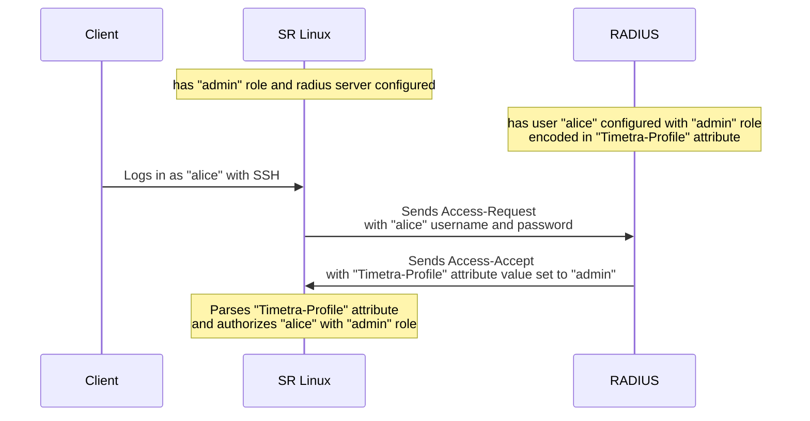

# User Authentication and Authorization with RADIUS on SR Linux

SR Linux supports a number of user authentication methods, including local authentication, TACACS+, and RADIUS. In this post, we will look at how to configure RADIUS authentication and authorization on SR Linux. As you may have already guessed, we will have a lab environment to play with sporting the [FreeRADIUS server][freeradius] and a single-node SR Linux lab. Let's get started!

<!-- more -->

## Introduction to AAA

Authentication, authorization, and accounting (AAA) is a framework for controlling access to network resources, enforcing policies, auditing usage, and providing the information necessary to bill for services. Authentication is the process of identifying users. Authorization is the process of granting access to network resources based on the identity of the user. Accounting is the process of tracking the use of network resources by users.

In this post, we will focus on user authentication and authorization performed by the FreeRADIUS server implementing the [RADIUS][radius]-based authentication and authorization for the remote users.

/// note | User types in SR Linux
The SR Linux supports three user types: Linux users, local users, and remote users. Each user type is authenticated differently.

**Remote users** are users that are not configured either in `/etc/passwd` or within the SR Linux configuration. Remote users are configured on a remote server, which is queried when the user attempts to log in to the SR Linux device. In the context of this post, remote users are configured on the FreeRADIUS server.

Read more about user types in the [SR Linux User Guide][user-types].
///

By leveraging the RADIUS protocol, SR Linux can authenticate remote users against a RADIUS server. Using the centralized service for bears a number of benefits, including:

- Centralized user authentication, authorization and management
- Support for multiple authentication methods and protocols
- SSO integration
- Scalability

## Authn and Authz with RADIUS on SR Linux

As mentioned above, centrally managing user authentication and authorization has a number of benefits. For the sake of this post and the accompanying lab, we will use the FreeRADIUS server as the central authentication and authorization service. The FreeRADIUS server is a popular open-source RADIUS server that has an [official container image][freeradius-container] available on Docker Hub and can be easily deployed in a containerized environment.

To keep things simple, we will configure the FreeRADIUS server with the following users:

- **alice** - a user with the `alice123` password that should have admin privileges on the SR Linux device
- **bob** - a user with the `bob123` password that should have read-only privileges on the SR Linux device

Authenticating users is the bread and butter of the RADIUS protocol, but how does the authorization work? It is all rooted in the SR Linux Role-Based Access Control (RBAC) model.

### SR Linux and Roles

Authorization via role based access control is performed for all SR Linux user types including the default local user admin[^1]. Users can be configured with a set of one or more roles that define the privileges for which they are authorized in the system.

A role consists of one or more rules, which specify a schema path the role can have privileges for, and a corresponding action, which can be read, write, or deny. After authentication, a user is authorized to perform the specified action defined in the path for the role the user is assigned.

In addition to the path-based access control, roles support service and plugin authorization. Service authorization allows you to limit the actions a user is authorized to perform to specific access types such as CLI and gNMI. CLI plug-in authorization gives you control over how operator-provided plug-ins are loaded.

By default, no roles are explicitly configured on the SR Linux device.

Here is how a `system-view` role can be defined in the SR Linux configuration that allows only read access to the `/system` subtree of the SR Linux YANG model:

```srl
--{ + candidate shared default }--[  ]--
A:srl# set / system configuration role system-view rule "/system" action read
```

Read more about roles in the [SR Linux User Guide][roles].

### Roles and RADIUS VSA

If SR Linux uses Roles to authorize users, you might be wondering how can the RADIUS server be configured to provide the associated roles for the users. And the answer is: [Vendor-Specific Attribute][vsa], or VSA.

When a RADIUS administrator creates a list of users on the RADIUS server, they can also assign custom attributes to them. These attributes are sent back to the RADIUS client (SR Linux) in the `Reply-Message` attribute of the Access-Accept message. The SR Linux RADIUS client parses the `Reply-Message` attribute and extracts the custom attributes, which are then used to configure the roles for the user. And this is how the RADIUS server can be used to authorize users on SR Linux.

Consider the following `authorize` file for the FreeRADIUS server:

```conf
"alice" Cleartext-Password := "alice123"
      Timetra-Profile := "admin"

"bob" Cleartext-Password := "bob123"
      Timetra-Profile := "viewer"
```

The `Timetra-Profile` attribute is a custom attribute that is used to convey the roles for the user. The `authorize` file above configures the `alice` user with the `admin` role and the `bob` user with the `viewer` role. The `admin` and `viewer` roles should be configured on the SR Linux device for the authorization to work.

Here is a flow diagram that illustrates the authentication and authorization process:



Don't fret if it is not crystal clear yet, we will go through the whole client and server configuration in the lab section below.

## Lab

The lab environment ([srl-labs/freeradius-lab][lab-repo]) for this post features a single SR Linux node and a FreeRADIUS server, all running in containers.

```yaml title="freeradius.clab.yml"
--8<-- "https://raw.githubusercontent.com/srl-labs/freeradius-lab/main/freeradius.clab.yml"
```

Deploy this lab with [Containerlab][clab] >= 0.49.0 using the following command:

```bash
sudo clab dep -c -t srl-labs/freeradius-lab
```

We assign the radius node with a static v4 address of `127.20.20.111` to make it deterministic and easy to rememeber when we get to configuring the SR Linux device. Additionally we add `-X` flag to the freeradius process to enable debugging output.

## RADIUS Server Configuration

The FreeRADIUS server is configured with:

1. the `clients.conf` file that defines the SR Linux device as a RADIUS client.  
    By default containerlab uses `172.20.20.0/24` network for the lab nodes so our `clients.conf` file will use this subnet address and a shared secret to encrypt the RADIUS messages:

    ```conf title="clients.conf"
    --8<-- "https://raw.githubusercontent.com/srl-labs/freeradius-lab/main/raddb/clients.conf"
    ```

2. the `authorize` file that defines the users and their roles. The `authorize` file lists two our users, `alice` and `bob`, and assigns them the `admin` and `viewer` roles respectively:

    ```conf title="authorize"
    --8<-- "https://raw.githubusercontent.com/srl-labs/freeradius-lab/main/raddb/mods-config/files/authorize"
    ```

Both files are mounted into the FreeRADIUS container using bind mounts. When the lab is deployed, the FreeRADIUS server will already be configured with the users and the SR Linux device as a RADIUS client, so we can move on to configuring the SR Linux device.

## SR Linux Configuration

The SR Linux configuration boils down to the following steps:

1. Create a RADIUS server group and add the FreeRADIUS server to it
2. Create roles for the remote users
3. Include RADIUS group in the authentication order

First, we log in to the SR Linux device:

```bash
ssh clab-radius-srl
```

and enter the configuration mode:

```srl
--{ running }--[  ]--
A:srl# enter candidate

--{ candidate shared default }--[  ]--
A:srl#
```

### RADIUS Server Group

Following the [SR Linux User Guide][radius-config], we create an AAA group called "RADIUS-DEMO" that lists our RADIUS server IP:

```srl
set / system aaa server-group RADIUS-DEMO type radius
set / system aaa server-group RADIUS-DEMO server 172.20.20.111 network-instance mgmt
set / system aaa server-group RADIUS-DEMO server 172.20.20.111 radius secret-key clab-demo
```

Note, that we use the statically assigned IP address of the RADIUS server and the shared secret that we defined in the `clients.conf` file.

### Roles

Next, we create the `admin` and `viewer` roles that we defined in the `authorize` file on the FreeRADIUS server:

```srl
set / system aaa authorization role "admin" services [ cli gnmi gnoi json-rpc ftp ]
set / system configuration role "admin" rule / action write

set / system aaa authorization role "viewer" services [ cli gnmi gnoi json-rpc ftp ]
set / system configuration role "viewer" rule / action read
```

Pay attention to the way we configure the roles. First we configure the `services` that the role is authorized for, and then we configure the rules that defines the path and the allowed action for the role. The `admin` role is authorized for all services and has write access to the entire YANG tree. The `viewer` role is authorized for all services and has read access to the entire YANG tree.

We apply the configuration and exit the configuration mode:

```srl
--{ * candidate shared default }--[  ]--
A:srl# commit now
All changes have been committed. Leaving candidate mode.
```

### Authentication Order

Finally, we configure the authentication order to use the RADIUS server group we created above:

```srl
set / system aaa authentication authentication-method [ RADIUS-DEMO local ]
```

## Testing RADIUS Authentication and Authorization

Now that we have the SR Linux device and the FreeRADIUS server configured, we can test the authentication and authorization process. The simplest way to do that is to perform SSH log in to the SR Linux device as the `alice` user and verify that the user has the `admin` role and can write to the entire YANG tree.

```bash
ssh alice@clab-radius-srl #(1)!
```

1. If you get "too many authentication failures" error, this is due to the fact that the SSH client tries to authenticate with all the keys available to it effectively exhausting authentication attempts quota. To avoid this, you can use `-o IdentitiesOnly=yes` option.

Using the `alice123` password that we provided in the `authorize` file, we should successfully log in to the SR Linux device. To ensure that RADIUS server was used for authentication, we can run `sudo docker logs -f clab-radius-radius` in a separate tab to see how RADIUS processed the authentication request.

Let's verify that SR Linux sees `alice` user as a remote user:

```srl
--{ + running }--[  ]--
A:srl# show system aaa authentication session *
  +----+-----------+--------------+-----------------------+----------+-----+-------------------+--------------------------+-------+
  | ID | User name | Service name | Authentication method | Priv-lvl | TTY |    Remote host    |        Login time        | Role  |
  +====+===========+==============+=======================+==========+=====+===================+==========================+=======+
  | 47 | alice*    | sshd         | RADIUS-DEMO           |          | ssh | 2001:172:20:20::1 | 2024-01-05T00:27:43.299Z | admin |
  +----+-----------+--------------+-----------------------+----------+-----+-------------------+--------------------------+-------+
```

As the table shows, our `alice` user is indeed authenticated via RADIUS for the `sshd` service and has the `admin` role. Let's verify that the user can write to the entire YANG tree:

```srl
--{ + running }--[  ]--
A:srl# enter candidate
--{ + candidate shared default }--[  ]--
A:srl# set / system information contact alice@clab
--{ +* candidate shared default }--[  ]--
A:srl# commit now
All changes have been committed. Leaving candidate mode.
```

Beatiful! Now let's log out and log in as the `bob` user and verify that the user has the `viewer` role and can only read the YANG tree.

```bash
ssh bob@clab-radius-srl
```

Using the `bob123` password that we provided in the `authorize` file, we should successfully log in to the SR Linux device. Checking the authenticated user session we can ensure that the `viewer` role was assigned to the user:

```srl
--{ + running }--[  ]--
A:srl# show system aaa authentication session *
  +----+-----------+--------------+-----------------------+----------+-----+-------------------+--------------------------+--------+
  | ID | User name | Service name | Authentication method | Priv-lvl | TTY |    Remote host    |        Login time        |  Role  |
  +====+===========+==============+=======================+==========+=====+===================+==========================+========+
  | 48 | bob*      | sshd         | RADIUS-DEMO           |          | ssh | 2001:172:20:20::1 | 2024-01-05T00:34:34.942Z | viewer |
  +----+-----------+--------------+-----------------------+----------+-----+-------------------+--------------------------+--------+
```

Can bob write to the YANG tree? Let's try:

```srl
--{ + running }--[  ]--
A:srl# enter candidate
--{ + candidate shared default }--[  ]--
A:srl# set / system information contact bob@clab
Error: No authorization to execute command: 'delete / system information contact alice@clab'
```

Oh ho! Looks like bob is not authorized to write to the YANG tree (as intended). Let's try to read the YANG tree:

```srl
--{ + candidate shared default }--[  ]--
A:srl# info from state /system information contact
    system {
        information {
            contact alice@clab
        }
    }
```

Bob reads the YANG tree just fine, as we intended!

## Bonus: RADIUS PCAP

If you are curious to see how the RADIUS messages look like, there is no better way to do that than to capture the RADIUS traffic. Containerlab makes it [easy to capture](https://containerlab.dev/manual/wireshark/) the traffic on the lab nodes. And [here is a pcapng][pcap] I captured while logging in as the `alice` user.

Here is how the Access-Accept message looks like with the vendor-specific attribute that contains the roles for the user:

```
RADIUS Protocol
    Code: Access-Accept (2)
    Packet identifier: 0x3 (3)
    Length: 33
    Authenticator: c14b24994938176b15f05e662ca371a5
    Attribute Value Pairs
        AVP: t=Vendor-Specific(26) l=13 vnd=Nokia(6527)
            Type: 26
            Length: 13
            Vendor ID: Nokia (6527)
            VSA: t=Timetra-Profile(4) l=7 val=admin
                Type: 4
                Length: 7
                Timetra-Profile: admin
```

[freeradius]: https://freeradius.org/
[radius]: https://datatracker.ietf.org/doc/html/rfc2865
[freeradius-container]: https://hub.docker.com/r/freeradius/freeradius-server/
[user-types]: https://documentation.nokia.com/srlinux/23-10/books/config-basics/secur-access.html#user-types
[roles]: https://documentation.nokia.com/srlinux/23-10/books/config-basics/secur-access.html#authorization-use-role-based-access-control
[vsa]: https://datatracker.ietf.org/doc/html/rfc2865#section-5.26
[lab-repo]: https://github.com/srl-labs/freeradius-lab
[clab]: https://containerlab.dev/
[radius-config]: https://documentation.nokia.com/srlinux/23-10/books/config-basics/secur-access.html#authorization-use-radius-server
[pcap]: https://gitlab.com/rdodin/pics/-/wikis/uploads/6a00c0c6f6c9039376f32a2c596f0653/srlinux-radius-authentication.pcapng

[^1]: With the exception of the linuxadmin/root users, which are permitted write access to all commands in the command tree.
