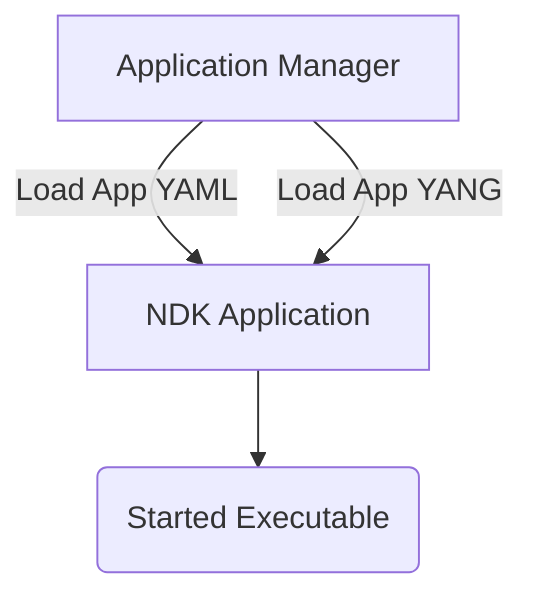

# Agent Structure

As was explained in the [NDK Architecture](architecture.md) section, an NDK agent[^10] is a custom software that can extend SR Linux capabilities by running alongside SR Linux's native applications and perform some user-defined work.

To deeply integrate with the rest of the SR Linux architecture, the agents have to be defined like an application that SR Linux's application manager can take control of. The structure of the agents is the main topic of this chapter.

<div class="grid" markdown>
<div markdown>
The main three components of an agent:

1. An executable file
2. A YANG module
3. Application configuration file

SR Linux application manager (which is like `systemd`) onboards the NDK application by reading its configuration file and YANG models and then starts the agent's executable file. We will cover the role of each of these components in the subsequent sections of this chapter.

</div>



</div>

## Application manager and Application configuration file

Recall the decoupled nature of SR Linux's architecture where each application is a separate process. Application manager is the service that is responsible for starting, stopping, and restarting applications, as well as for monitoring their health.

Both native SR Linux applications (AAA, LLDP, BGP, etc.) and NDK agents are managed by the application manager. Applications that are managed by the application manager should have a configuration file[^30] that describes the application and its lifecycle. For native SR Linux applications the app config files are located by the `/opt/srlinux/appmgr` path, and for NDK agents, the files are located by the `/etc/opt/srlinux/appmgr` path.

With an agent's config file, users define properties of an application, for example:

* application version
* location of the executable file
* YANG modules related to this app
* lifecycle management policy

NDK agents must have their config file present by the `/etc/opt/srlinux/appmgr` directory. It is a good idea to name the agent's config file after the agent's name; if we have the agent called `greeter`, then its config file can be named `greeter.yml` and stored by the `/etc/opt/srlinux/appmgr/greeter.yml` path.

Let's have a look at configuration file for a simple `greeter` NDK written in Go:

```yaml
greeter:
  path: /usr/local/bin #(1)!
  launch-command: greeter #(2)!
  version-command: greeter --version #(3)!
  failure-action: wait=10 #(4)!
  config-delivery-format: json #(5)!
  yang-modules:
    names:
      - "greeter" #(6)!
    source-directories:
      - "/opt/greeter/yang"   #(7)!
```

1. The path to use when searching for the executable file.
2. The binary app manager will launch. Relative to the `path`.
3. The command to run to get the version of the application. The version can be seen in the output of `show / system application <app name>`.
4. An action to carry out when the application fails (non zero exit code). The action can be one of the following:
    * `reboot` - reboot the system
    * `wait=<seconds>` - wait for `<seconds>` and then restart the application
5. The encoding format of the application's configuration when it is delivered to the application by the Notification Service.

    For NDK agents the recommended format is `json`.

6. The names of the YANG modules to load. This is usually the file-name without `.yang` extension.

    The YANG modules are searched for in the directories specified by the `source-directories` property.

7. The source directories where to search for the YANG modules. The `/opt/greeter/yang` directory should contain a YANG module with the `greeter` name.

    If your agent imports any existing SR Linux YANG modules, you should add the `/opt/srlinux/models/srl_nokia` directory to the list of source directories.

///details | Complete list of config files parameters

```yaml
# Example configuration file for the applications on sr_linux
# All valid options are shown and explained
# The name of the application.
# This must be unique.
application-name:
    # [Mandatory] The source path where the binary can be found
    path: /usr/local/bin
    # [Optional, default='./<application-name>'] The command to launch the application.
    # Note these replacement rules:
    #   {slot-num} will be replaced by the slot number the process is running on
    #   {0}, {1}, ... can be replaced by parameters provided in the launch request (launch-by-request: Yes)
    launch-command: "VALUE=2 ./binary_name --log-level debug"
    # [Optional, default='<launch-command>'] The command to search for when checking if the application is running.
    # This will be executed as a prefix search, so if the application was launched using './app-name -loglevel debug'
    # a search-command './app-name' would work.
    # Note: same replacement rules as launch-command
    search-command: "./binary_name"
    # [Optional, default=No] Indicates whether the application needs to be launched automatically
    never-start: No
    # [Optional, default=No] Indicates whether the application can be restarted automatically when it crashes.
    # Applies only when never-start is No (if the app is not started by app_mgr it would not be restarted either).
    # Applications are only restarted when running app_mgr in restart mode (e.g. sr_linux --restart)
    never-restart: No
    # [Optional, default=No] Indicates whether the application will be shown in app manager status
    never-show: No
    # options are "proto-json", "json", "binary-tlvs" (default is proto-json)
    config-delivery-format: json
    # [Optional, default=No] Indicates whether the launch of the application is delayed
    # until any configuration is loaded in the application's YANG modules.
    wait-for-config: No
    # [Optional] Indicates the application is run as 'user' including 'root'
    run-as-user: root
    # [Optional, default=200] Indicates the order in which the application needs to be launched.
    # The applications with the lowest value are launched first.
    # Applications with the same value are launched in an undefined order.
    # By convention, start-order >= 100 require idb.  1 is reserved for device-mgr, which determines chassis type.
    start-order: 123
    # [Optional, default=No] Indicates whether this application is launched via an request (idb only at this point).
    launch-by-request: No
    # [Optional, default=No] Indicates whether this application is launched in a net namespace (launch-by-request
    # must be set to Yes).
    launch-in-net-namespace: No
    # [Optional, default=3] Indicates the number of restarts within failure-window which will trigger the system restart
    failure-threshold: 3
    # [Optional, default=300] Indicates the window in seconds over which to count restarts towards failure-threshold
    failure-window: 400
    # [Optional, default=reboot] Indicates the action taken after 'failure-threshold' failures within 'failure-window'
    failure-action: 'reboot'
    # [Optional, default=Nokia] Indicates the author of the application
    author: 'Nokia'
    # [Optional, default=””] The command for app_mgr to run to read the application version
    version-command: 'snmpd --version'
    # [Optional The operations that may not be manually performed on this application
    restricted-operations: ['start', 'stop', 'restart', 'quit', 'kill']
    # [Optional, default No] app-mgr will wait for app to acknowledge it via oob channel
    oob-init: No
    # [Optional] The list of launch restrictions - if of all of the restrictions of an element in the list are met,
    # then the application is launched.  The restrictions are separated by a ':'.  Valid restrictions are:
    #   'sim' - running in sim mode (like in container env.)
    #   'hw' - running on real h/w
    #   'chassis' - running on a chassis (cpm and imm are running on different processors)
    #   'imm' - runs on the imm
    #   'cpm' - runs on the cpm (default)
    launch-restrictions: ['hw:cpm', 'hw:chassis:imm']
    # [Optional] The list of linux capabilities to grant to the application.
    # The capabilities are specified as a list of capability keys (without the 'CAP_' prefix).
    capability-bounding-set:
        - NET_ADMIN
    yang-modules:
        # [Mandatory] The names of the YANG modules to load. This is usually the file-name without '.yang'
        names: [module-name, other-module-name]
        # [Optional] List of enabled YANG features. Each needs to be qualified (e.g. srl_nokia-common:foo)
        enabled-features: ['module-name:foo', 'other-module-name:bar']
        # [Optional] The names of the YANG validation plugins to load.
        validation-plugins: [plugin-name, other-plugin-name]
        # [Mandatory] All the source-directories where we should search for:
        #    - The YANG modules listed here
        #    - any YANG module included/imported in these modules
        source-directories: [/path/one, /path/two]
        # [Optional] The names of the not owned YANG modules to load for commit confirmation purposes.
        not-owned-names: [module-name, other-module-name]
# [Optional] Multiple applications can be defined in the same YAML file
other-application-name:
    command: "./other-binary"
    path: /other/path
```

///

When Application Manager is started/reloaded, it watches for application configuration files in the `/opt/srlinux/appmgr` and `/etc/opt/srlinux/appmgr` directories and starts managing the applications.

Let us now have a closer look at the main components of an agent and understand their role.

## YANG module

SR Linux is a [fully modeled](../../yang/index.md) Network OS - any native or custom application that can be configured or can have state is required to have a proper YANG model describing the data.

The "cost" associated with requiring application developers to write YANG models for their apps pays off immensely as this

* enables seamless application integration with **all** management interfaces: CLI, gNMI, JSON-RPC, etc.  
    Any agent's configuration knobs that users expressed in YANG will be immediately available in the SR Linux CLI as if it was part of it from the beginning. Yes, with auto-suggestion of the fields as well.
* provides out-of-the-box Streaming Telemetry (gNMI) support for any config or state data that the application maintains

And secondly, the YANG modules for custom apps are not that hard to write as their data model is typically relatively small.

///note
The YANG module is only needed if a developer wants their agent to be configurable via any management interfaces or keep state.
///

YANG files related to an agent are typically located by the `/opt/$agentName/yang` directory.

Consider the following YANG module for a simple `greeter` agent:

```{.yang title="yang/greeter.yang"}
--8<-- "https://raw.githubusercontent.com/srl-labs/ndk-greeter-go/main/yang/greeter.yang"
```

The YANG module defines a container called `greeter` with two leaf nodes: `name` and `greeting`. The `name` leaf is a configuration node, and the `greeting` leaf is a state node.

With this YANG module our application will populate the configuration datastore of SR Linux with `name` leaf and state datastore with `name` and `greeting` leaves.

## Executable file

Executable file is the main component of an agent as it contains the application logic. Depending on the language you choose to write your agent in, the executable file can be a binary or a script[^20].

The application logic handles the configuration that may be provided by users via any management interface (CLI, gNMI, etc.) and contains the core business logic of the application that may be triggered by some events from SR Linux service.

In the subsequent sections of the Developers Guide, we will dive into the details of how to write an sample NDK application in [Go](dev/go/index.md) and [Python](dev/py/index.md).

An executable file can be placed at `/usr/local/bin` directory.

## Auxiliary files

Quite often, an agent may require additional files for its operation. It can be a virtual environment for your Python agent or some JSON file that your agent consumes.

All those auxiliary files can be saved by the `/opt/$agentName/` directory.

[^10]: terms agent and application are used interchangeably.
[^20]: Binaries are typically relevant for compiled languages like C, Go, Rust, etc. Scripts are typically relevant for interpreted languages like Python.
[^30]: Expressed in YAML format.
