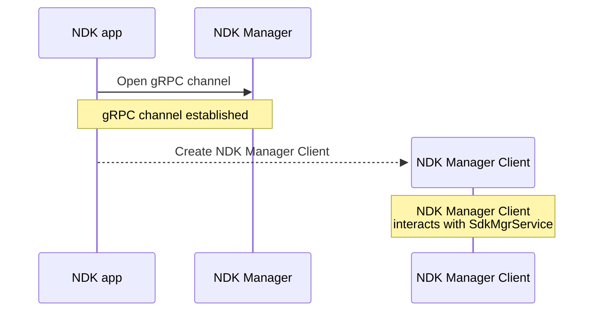
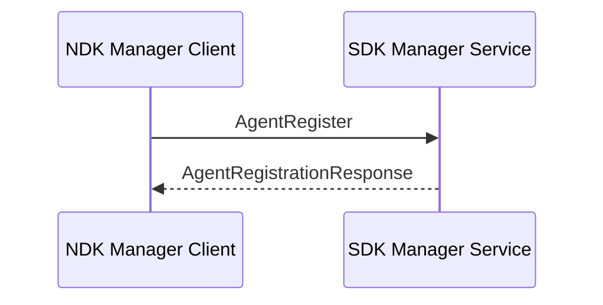
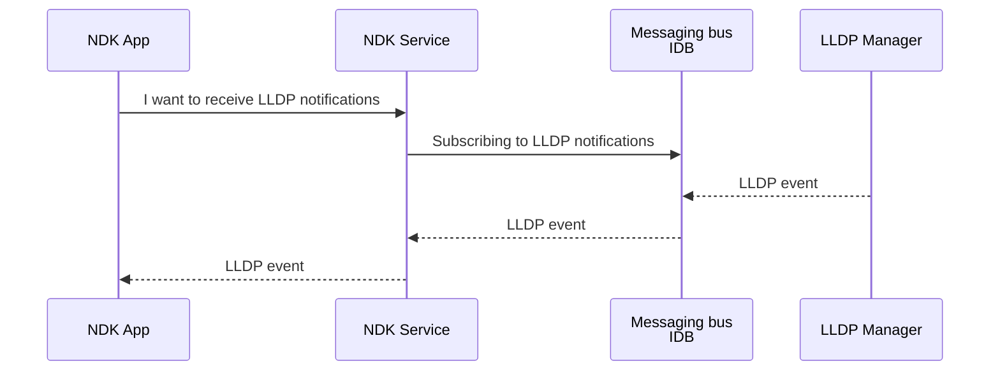

# NDK Operations

When NDK application is [installed](./agent-install-and-ops.md) on SR Linux it interfaces with the NDK service via gRPC. Regardless of programming language the agent is written in, every application will perform the following basic NDK operations (as shown in Fig. 1):

1. Establish gRPC channel with NDK manager and instantiate an NDK client
2. Register the agent with the NDK manager
3. Register notification streams for different types of NDK services (config, lldp, interface, etc.)
4. Start streaming notifications
5. Handle the streamed notifications
6. Perform some work based on the received notifications
7. Update agent's state data if required
8. Exit gracefully by unregistering the agent

<figure>
  

  <figcaption>Fig 1. NDK operations flow</figcaption>
</figure>

To better understand the steps an agent undergoes, we will explain them in a language-neutral manner. For language-specific implementations, read the "Developing with NDK" chapter.

## Creating NDK Manager Client

NDK agents communicate with gRPC-based NDK service by means of remote procedure calls (RPC). An RPC generally takes in a client request message and returns a response message from the server.

First, a gRPC channel must be established with the NDK manager application running on SR Linux[^10]. By default, NDK server listens for connections on a unix socket `unix:///opt/srlinux/var/run/sr_sdk_service_manager:50053`[^20] and doesn't require any authentication. NDK app is expected to connect to this socket to establish gRPC.

Once the gRPC channel is set up, a gRPC client (often called _the stub_) needs to be created to perform RPCs. In gRPC, each service requires its own client and in NDK the [`SdkMgrService`][sdk_mgr_svc_doc] service is the first service that agents interact with.  
Therefore, users first need to create the NDK Manager Client (_Mgr Client_ in Fig. 1) that will be able to call RPCs of [`SdkMgrService`][sdk_mgr_svc_doc].

/// tip
In the proto files and the generated NDK documentation the NDK services have `Sdk` in their name. While in fact NDK is a fancy name for an SDK, we would like to call the client of the `SdkMgrService` the NDK Manager Client.
///

## Agent registration

With the gRPC channel set up and the NDK Manager Client created, we can start using the NDK service. The first mandatory step is the agent registration with the NDK Manager. At this step NDK initializes the state of our agent, creates the IDB tables and assigns an ID to our application.

The registration process is carried out by calling [`AgentRegister`](https://github.com/nokia/srlinux-ndk-protobufs/blob/protos/ndk/sdk_service.proto#L32) RPC of the [`SdkMgrService`][sdk_mgr_svc_doc]. A [`AgentRegistrationResponse`][agent_reg_resp_doc] is returned (omitted in Fig. 1) with the status of the registration process and application ID assigned to the app by the NDK.

## Subscribing to notifications

Remember we said that NDK Agents can interact with other native SR Linux apps? The interaction is done by subscribing to notifications from other SR Linux applications with NDK Manager acting like a gateway between your application and the messaging bus that all SR Linux applications communicate over.

For example, an NDK app can get information from Network Instance, Config, LLDP, BFD and other applications by requesting subscription to notification updates from these applications:

<!-- --8<-- [start:notif-diagram] -->

<!-- --8<-- [end:notif-diagram] -->

Let's have a closer look at what it takes to subscribe to notifications from other SR Linux applications.

### Creating notification stream

Prior to subscribing to any application's notifications a subscription stream needs to be created. A client of [`SdkMgrService`][sdk_mgr_svc_doc] calls `NotificationRegister` RPC providing [`NotificationRegistrationRequest`][notif_reg_req_doc] message with the `op` field set to `Create` and other fields absent.

/// details | Other values of Registration Request operations field
`NotificationRegistrationRequest` message's field `op` (short for "operation") may have one of the following values:

- `Create` creates a subscription stream and returns a `StreamId` that is used when adding subscriptions with the `AddSubscription` operation.
- `Delete` deletes the existing subscription stream that has a particular `SubId`.
- `AddSubscription` adds a subscription. The stream will now be able to stream notifications of that subscription type (e.g., Intf, NwInst, etc).
- `DeleteSubscription` deletes the previously added subscription.
///

NDK Manager responds with [`NotificationRegisterResponse`][notif_reg_resp_doc] message with the allocated `stream_id` value. The stream has been created, and the subscriptions can now be added to the created stream.

### Adding subscriptions

With subscription stream allocated we can proceed with adding one or more subscriptions to it. [`SdkMgrService`][sdk_mgr_svc_doc] service offers `NotificationRegister` RPC to add subscriptions to the stream. The RPC uses the same [`NotificationRegistrationRequest`][notif_reg_req_doc] message (step 4 in Fig. 1) as we used to create the stream, but now with the following fields set:

- `stream_id` set to an obtained value from the previous step
- `op` is set to `AddSubscription`
- one of the supported [`subscription_types`][sub_types] according to the desired service notifications. For example, if we are interested to receive [`Config`][cfg_svc_doc] notifications, then `config` field of type [`ConfigSubscriptionRequest`][cfg_sub_req_doc] is set.

[`NotificationRegisterResponse`][notif_reg_resp_doc] message (step 5 in Fig. 1) is returned and contains the same `stream_id` value and now also the `sub_id` value - a subscription identifier. At this point NDK application indicated its intention to receive notifications from certain services, but the notification streams haven't been started yet.

## Streaming notifications

Requesting applications to send notifications is done by interacting with [`SdkNotificationService`][sdk_notif_svc_doc]. As this is another gRPC service, it requires its own client - Notification client. Steps 6 and 7 in Fig. 1 show the interaction between the Notification Client and the Notification service.

To initiate streaming of the notifications requested in the previous step the Notification Client calls [`NotificationStream`][sdk_notif_svc_doc] RPC with [`NotificationStreamRequest`][notif_stream_req_doc] message with `stream_id` field set to the ID of a stream to be used. This RPC returns a **stream** of [`NotificationStreamResponse`][notif_stream_resp_doc], which makes this RPC to be classified as "server streaming RPC".

/// details | Server-streaming RPC
A [server-streaming RPC](https://grpc.io/docs/what-is-grpc/core-concepts/#server-streaming-rpc) is similar to a unary RPC, except that the server returns a stream of messages in response to a client's request.  
After sending all its messages, the server's status details (status code and optional status message) and optional trailing metadata are sent to the client. This completes processing on the server side. The client completes once it has all the server's messages.
///

The Notification client starts to receive a stream of `NotificationStreamResponse` messages where each message contains one or more [`Notification`][notif_doc] message. The [`Notification`][notif_doc] message itself will contain a field with one of the [`subscription_types`][sub_types] notifications, which will be set in accordance to the type of the notification requested on this stream in the [Adding subscriptions](#adding-subscriptions) step.

In our example, we sent `ConfigSubscriptionRequest` inside the `NotificationRegisterRequest`, hence the notifications that we will get back for that `stream_id` will contain [`ConfigNotification`][cfg_notif_doc] messages inside `Notification` of a `NotificationStreamResponse`.

## Handling notifications

Now we reached the point where our custom Application can start doing actual work. The application receives a stream of notifications from the NDK Manager based on the subscriptions it requested.  
The application needs to handle the notifications and perform some work based on the received data.

For example, if the application requested to receive `Config` notifications, it will receive a stream of [`ConfigNotification`][cfg_notif_doc] messages containing the configuration changes that happened on the SR Linux system for this application's configuration. The application then can parse the received data and perform some work based on it.

The Server streaming RPC will provide notifications till the last available one and block awaiting more notifications to send; the application then reads out the incoming notifications and handles the messages contained within them. Some notification messages have `SyncStart` and `SyncEnd` messages that indicate the start and end of a stream of notifications. The application can use these messages to synchronize its state with the SR Linux system.  
For example, when streaming out routes from the RIB table, the application can use `SyncStart` and `SyncEnd` messages to know when the stream of routes is complete and can start processing the received routes.

## Handling application's configuration and state

As any other "regular" application, NDK applications can have their own configuration and state modelled with YANG and injected in the global config/state of the SR Linux NOS.

When NDK developer defines the YANG model for the application, they can model configuration and state data that will be accessible via CLI and all other management interfaces. The configuration data can be edited by a user via common management interfaces and delivered to the application via NDK. This workflow enables configuration management of the application via the same management interfaces as the rest of the SR Linux system.

Once configured, the application may need to update its state data based on the received notifications and the work it carried out. The state of the application becomes part of the SR Linux state datastore and is accessible via all management interfaces.

<figure>
  

  <figcaption>Fig 2. Updating agent's state flow</figcaption>
</figure>

Updating or creating agent's state is done with [`TelemetryAddOrUpdate`][sdk_mgr_telem_svc_doc] RPC that uses [`TelemetryUpdateRequest`][telem_upd_req_doc] message with a list of [`TelemetryInfo`][telem_info_doc] messages. Each `TelemetryInfo` message contains a `key` field that points to a subtree of agent's YANG model that needs to be updated with the JSON data contained within the `data` field.

## Exiting gracefully

When an agent needs to stop its operation and/or be removed from the SR Linux system, it needs to unregister by invoking `AgentUnRegister` RPC of the [`SdkMgrService`][sdk_mgr_svc_doc]. The gRPC connection to the NDK server needs to be closed.

When unregistered, the agent's state data will be removed from SR Linux system and will no longer be accessible to any of the management interfaces.

[sdk_mgr_svc_doc]: https://rawcdn.githack.com/nokia/srlinux-ndk-protobufs/v0.2.0/doc/index.html#srlinux.sdk.SdkMgrService
[sdk_mgr_svc_proto]: https://github.com/nokia/srlinux-ndk-protobufs/blob/protos/ndk/sdk_service.proto
[sdk_notif_svc_doc]: https://rawcdn.githack.com/nokia/srlinux-ndk-protobufs/v0.2.0/doc/index.html#srlinux.sdk.SdkNotificationService
[sdk_mgr_telemetry_proto]: https://github.com/nokia/srlinux-ndk-protobufs/blob/protos/ndk/telemetry_service.proto
[notif_reg_req_doc]: https://rawcdn.githack.com/nokia/srlinux-ndk-protobufs/v0.2.0/doc/index.html#srlinux.sdk.NotificationRegisterRequest
[notif_reg_resp_doc]: https://rawcdn.githack.com/nokia/srlinux-ndk-protobufs/v0.2.0/doc/index.html#srlinux.sdk.NotificationRegisterResponse
[cfg_svc_doc]: https://rawcdn.githack.com/nokia/srlinux-ndk-protobufs/v0.2.0/doc/index.html#ndk%2fconfig_service.proto
[cfg_notif_doc]: https://rawcdn.githack.com/nokia/srlinux-ndk-protobufs/v0.2.0/doc/index.html#srlinux.sdk.ConfigNotification
[cfg_sub_req_doc]: https://rawcdn.githack.com/nokia/srlinux-ndk-protobufs/v0.2.0/doc/index.html#srlinux.sdk.ConfigSubscriptionRequest
[notif_stream_req_doc]: https://rawcdn.githack.com/nokia/srlinux-ndk-protobufs/v0.2.0/doc/index.html#srlinux.sdk.NotificationStreamRequest
[notif_stream_resp_doc]: https://rawcdn.githack.com/nokia/srlinux-ndk-protobufs/v0.2.0/doc/index.html#srlinux.sdk.NotificationStreamResponse
[notif_doc]: https://rawcdn.githack.com/nokia/srlinux-ndk-protobufs/v0.2.0/doc/index.html#srlinux.sdk.Notification
[sdk_mgr_telem_svc_doc]: https://rawcdn.githack.com/nokia/srlinux-ndk-protobufs/v0.2.0/doc/index.html#srlinux.sdk.SdkMgrTelemetryService
[telem_upd_req_doc]: https://rawcdn.githack.com/nokia/srlinux-ndk-protobufs/v0.2.0/doc/index.html#srlinux.sdk.TelemetryUpdateRequest
[telem_info_doc]: https://rawcdn.githack.com/nokia/srlinux-ndk-protobufs/v0.2.0/doc/index.html#srlinux.sdk.TelemetryInfo
[agent_reg_resp_doc]: https://rawcdn.githack.com/nokia/srlinux-ndk-protobufs/v0.2.0/doc/index.html#srlinux.sdk.AgentRegistrationResponse
[sub_types]: https://github.com/nokia/srlinux-ndk-protobufs/blob/protos/ndk/sdk_service.proto#L125

[^10]: `sdk_mgr` is the name of the application that implements NDK gRPC server and runs on SR Linux OS.
[^20]: The server is also available on a TCP socket `localhost:50053`.
